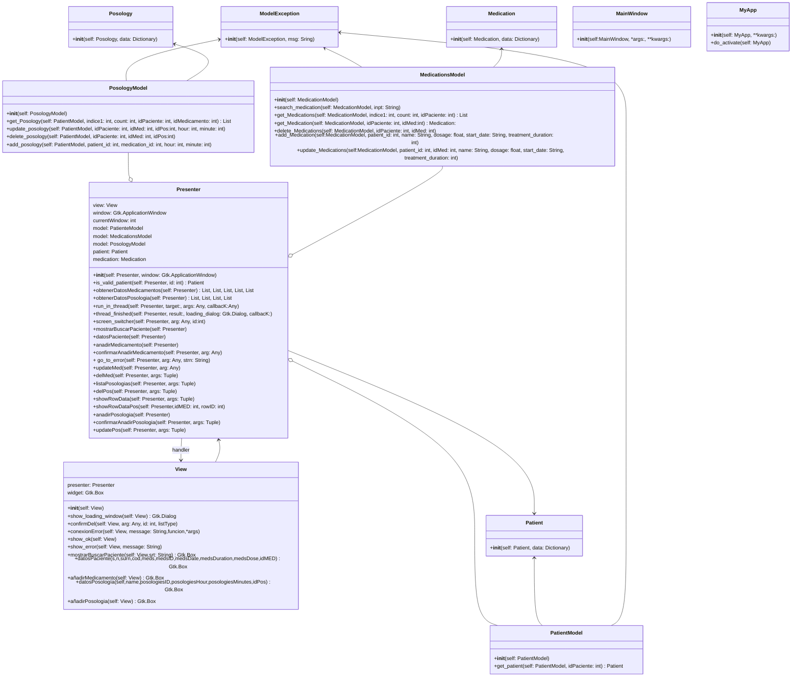
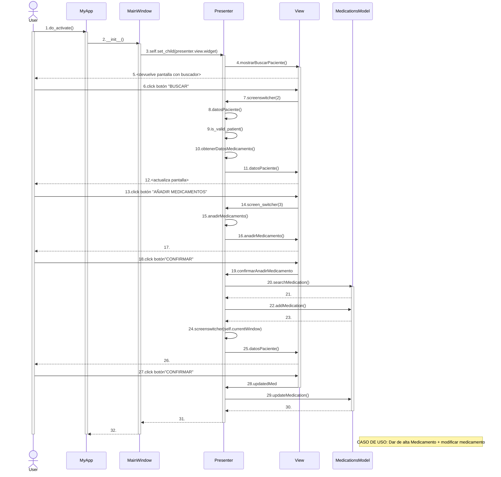
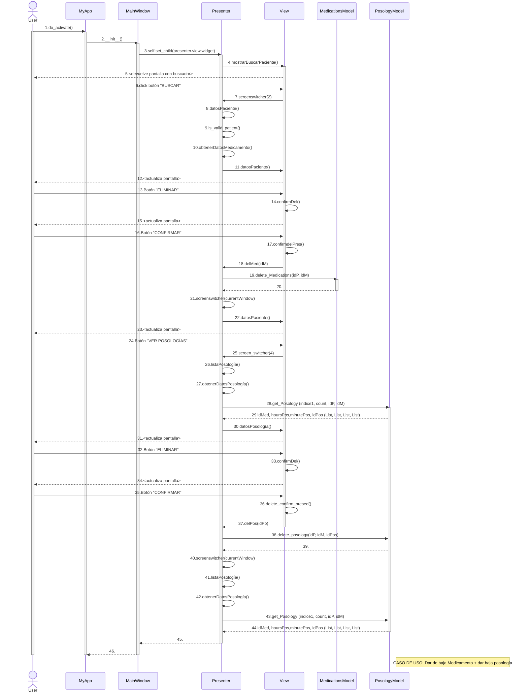
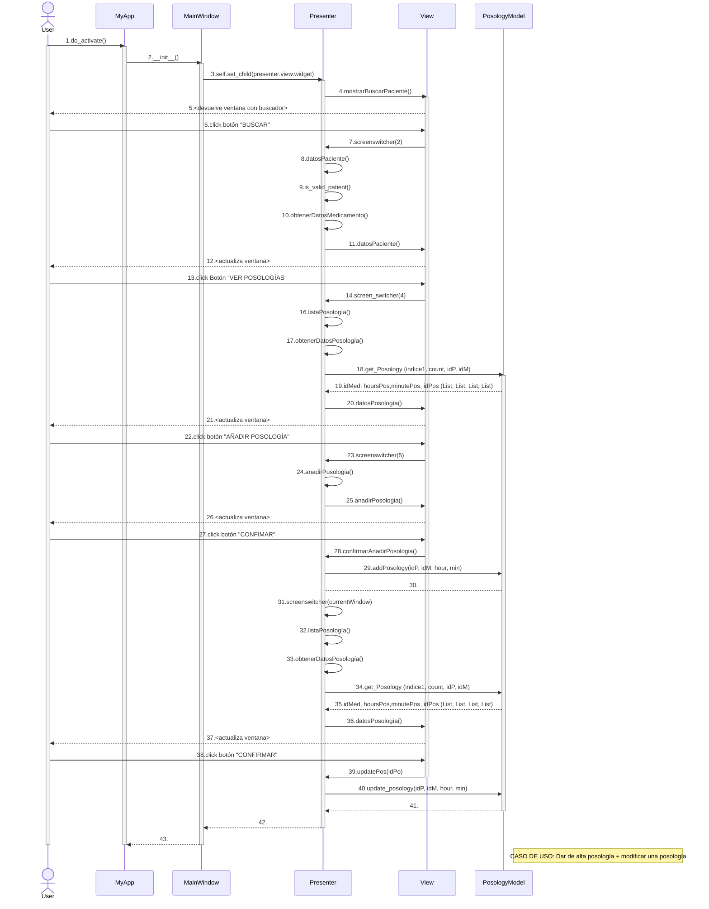
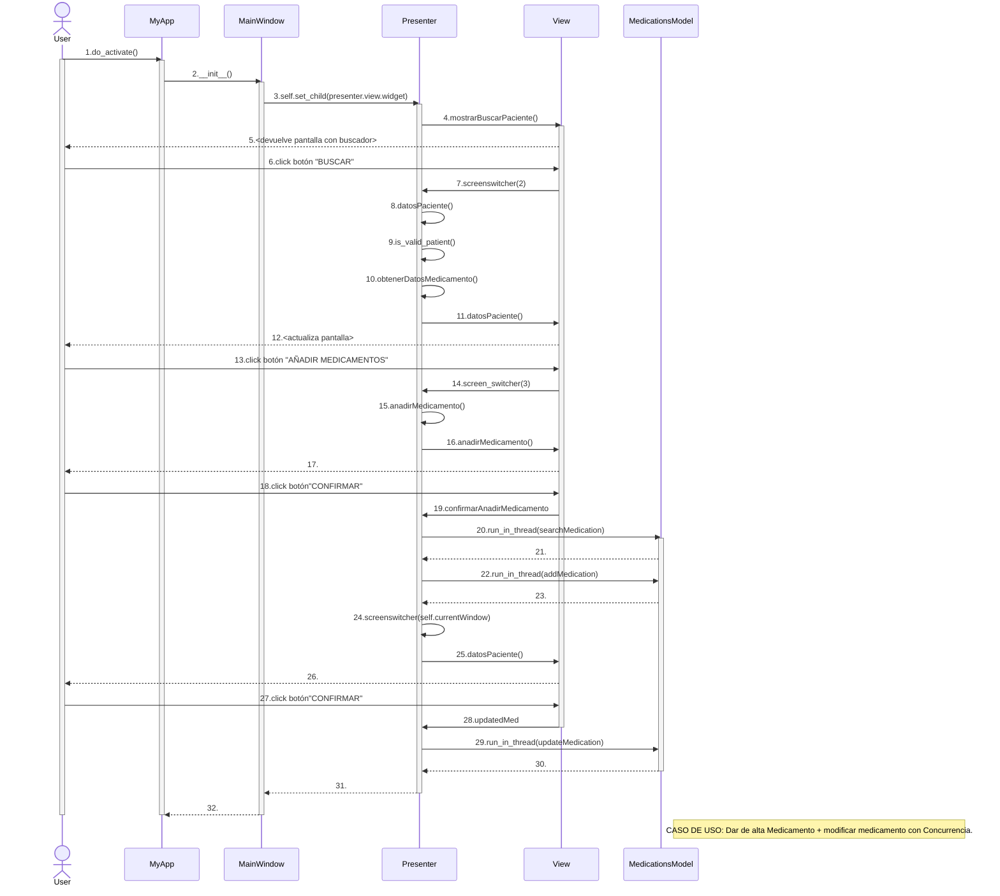
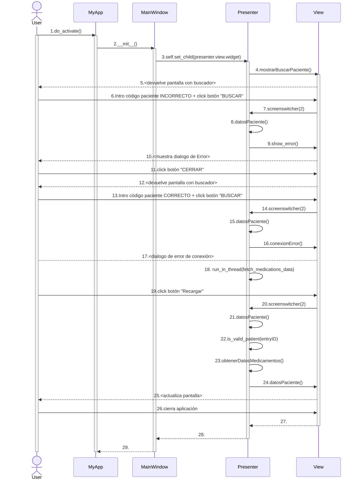

# Diseño software. Patrón Modelo-Vista-Controlador.
## Diagramas UML
### Diagrama parte estática:

### Diagramas parte dinámica:

#### Dar de alta Medicamento y modificar medicamento:

Diagrama dinámico que ejemplifica como se añade un medicamento a un paciente determinado, después se modifica un medicamento y tras esto se deja de usar la aplicación.

#### Dar de baja Medicamento/Posología:

Diagrama dinámico que ejemplifica como se elimina un medicamento, se consultan las posologías de un medicamento, se elimina una y tras esto se deja de usar la aplicación.

#### Alta y modificación Posología:

Diagrama dinámico que ejemplifica como se consultan posologías de un medicamento, se añade una posología, se modifica una posología y finalmente se deja de usar la aplicación.

#### Dar de alta Medicamento y modificar medicamento con Concurrencia:

Diagrama dinámico que ejemplifica como se añade un medicamento a un paciente determinado, después se modifica un medicamento y tras esto se deja de usar la aplicación.
Teniendo en cuenta el comportamiento concurrente de la aplicación.

#### Intento de inicio con errores:

Diagrama dinámico que ejemplifica como se intenta entrar en la aplicación con un código incorrecto y después de corregirlo se produce un error de conexión del que 
se recupera y finaliza mostrando la pantalla de medicamentos del paciente. Para finalizar el ejemplo el usuario sale de la aplicación. 

