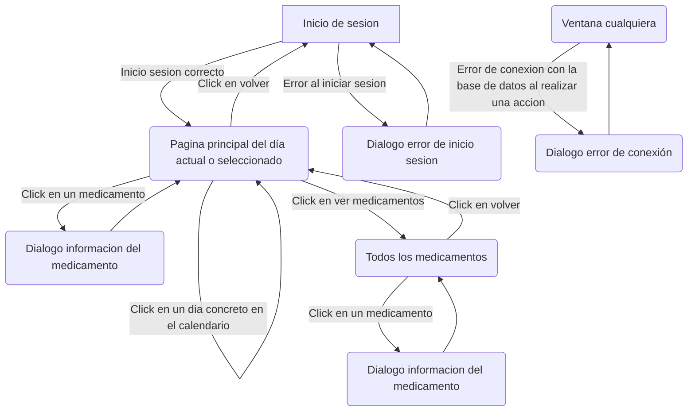
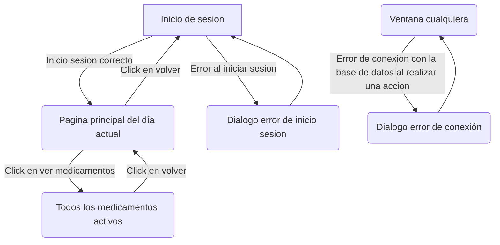

# DIAGRAMA PARA MOVILES

```mermaid
    flowchart TD
        A[Inicio de sesion] -->|Inicio sesion correcto| B(Pagina principal del día actual o seleccionado)
        A -->|Error al iniciar sesion| C(Dialogo error de inicio sesion)
        C --> A
        B --> |Click en volver|A
        B --> |Click en un dia concreto en el calendario| B
        B --> |Click en un medicamento|D(Dialogo informacion del medicamento)
        D --> B
        B --> |Click en ver medicamentos|E(Todos los medicamentos)
        E --> |Click en volver|B
        E --> |Click en un medicamento|F(Dialogo informacion del medicamento)
        F --> E
        X(Ventana cualquiera) --> |Error de conexion con la base de datos al realizar una accion|Z(Dialogo error de conexión)
        Z --> X
```
# DIAGRAMA PARA RELOJES

```mermaid
    flowchart TD
        A[Inicio de sesion] -->|Inicio sesion correcto| B(Pagina principal del día actual)
        A -->|Error al iniciar sesion| C(Dialogo error de inicio sesion)
        C --> A
        B --> |Click en volver|A
        B --> |Click en ver medicamentos|E(Todos los medicamentos activos)
        E --> |Click en volver|B
        X(Ventana cualquiera) --> |Error de conexion con la base de datos al realizar una accion|Z(Dialogo error de conexión)
        Z --> X
```
