# Diseño software
## Patrón Provider

<!-- ## Notas para el desarrollo de este documento
En este fichero debeis documentar el diseño software de la práctica.

> :warning: El diseño en un elemento "vivo". No olvideis actualizarlo
> a medida que cambia durante la realización de la práctica.

> :warning: Recordad que el diseño debe separar _vista_ y
> _estado/modelo_.
	 

El lenguaje de modelado es UML y debeis usar Mermaid para incluir los
diagramas dentro de este documento. Por ejemplo:

-->

#### Diagrama parte estática (para móvil y reloj):

```mermaid
classDiagram

Model <.. _InicioState: << Listener >>
Model <.. _Pagina2State: << Listener >>
Model <.. ListaCompletaMedicamentos: << Listener >>
Model <.. _marcarMedState: << Listener >>
Model <.. _CheckState: << Listener >>

Model <.. _InicioStateReloj: << Listener >>
Model <.. _marcarMedStateReloj: << Listener >>
Model <.. ListaCompletaMedicamentosActivosReloj: << Listener >>
Model <.. _CheckStateReloj: << Listener >>

MedicationToday <-- Check  
_CheckState --o Check
_marcarMedState --o MarcarMed
_Pagina2State --o Pagina2 
_InicioState --o Inicio 

_InicioStateReloj --o LoginReloj
_marcarMedStateReloj --o MarcarMedReloj
_CheckStateReloj --o Check

Model --> dbItem
Model --> Patient
Model --> Medication
Model --> Posology
Model --> Intake
Model --> MedicationToday


ChangeNotifier <|-- Model

class MyApp  {
  maxDimension: double = 400.0 
  +build(context: BuildContext ): Widget
}


class ModelException{
  message: String 
  << constructor >>+ModelException(this.message: String)
}

class dbItem {
  data: Map<String, dynamic>
  << constructor >>+dbItem(this.data)
}

class Patient{
  id: int 
  name: String
  << constructor >>+Patient(db: dbItem)
}

class Medication{
  id: int
  name: String
  dosage: double
  start_date: String
  duration: int
  << constructor >>+Medication(db: dbItem)
}

class Posology{
  hour: int 
  minute: int
  << constructor >>+Posology(db: dbItem )
}


class Intake{
  date: DateTime ;
  << constructor >>+Intake(db: dbItem) 
}

class MedicationToday{
  med: Medication
  time: DateTime
  taken: boolean
  << constructor >>+MedicationToday(med1: Medication, taken1: bool, time1: DateTime)
}

class Model {
  _pat: Patient
  _intk: List<Intake>
  _pos: List<Posology>
  _medListToday: List<MedicationToday>
  _medList: List<Medication>
  _activeMedList: List<Medication>
  _notActiveMedList: List<Medication> 
  _dataSeleccionada: DateTime
  _semanas: List<DateTime> 

  +getPatient(patientId: String) async

  +getPatient1() async 

  +getMedList() async 
   
  +getPosList(medID: int) async 

  +getIntakeList(medID: int) async 


  +getMedicationsToday(date: DateTime) async 


  +getActiveMedications()

  +addIntake(medId: int, date: DateTime) async

  +actualizarSemanas() 

  +seleccionarData(date: DateTime ) async 

  +retrocederSemanas() async 

  +avanzarSemanas() async 

  +initHomepage() async 
}

class Inicio {
  +createState(): _InicioState 
}

class _InicioState {
  _controller: TextEditingController= TextEditingController() 
  _patientCode: String 

  +dispose():void 
  +build(context: BuildContext) Widget 

  +cuerpo(context: BuildContext) Widget


  +NombreApk1() Widget

  +NombreApk2() Widget 

  +CodigoPaciente() Widget 

  +botonLogin(context: BuildContext) Widget 
    
}

class Pagina2 {
  +createState() _Pagina2State
}

class _Pagina2State{
  _pagAct: int
  +build(context: BuildContext) Widget
  +_showDialog(context: BuildContext) void  
}



class ListaCompletaMedicamentos {
 
  +build(context: BuildContext) Widget 
    
}

class MarcarMed {

  +createState(): _marcarMedState 
}

class _marcarMedState{ 
  +initState(): void  
  +formatDate(date: DateTime): String 
  +build(context: BuildContext ): Widget   
  +calendario(): Widget 

}

class Check  {
  med: MedicationToday 
  today: DateTime 
  << constructor >>+Check()
  +createState(): _CheckState 
}

class _CheckState {
  +initState(): void
  +_mostrarDetallesMed(context: BuildContext, medt: MedicationToday) void  
  +_confirmarToma(context: BuildContext ) void
  +build(context:BuildContext) Widget 
}

class ListaCompletaMedicamentosActivosReloj {

   +build(context: BuildContext) Widget
   }


class LoginReloj  {
 
   +createState() _InicioState
}

class _InicioStateReloj  {
   _controller:  TextEditingController = TextEditingController();
   _patientCode: String
 
   +dispose() void 
   +build(context: BuildContext) Widget
   +cuerpo(context: BuildContext) Widget
  +NombreApk1() Widget
  +NombreApk2() Widget 
  +CodigoPaciente() Widget 
  +botonLogin(context: BuildContext) Widget
  
}
class MarcarMedReloj  {
  
   +createState()_marcarMedState
}

class _marcarMedStateReloj {

  
 +initState() void  
  +formatDate(date: DateTime) String 
  +build(context: BuildContext ) Widget   
  +calendario() Widget 
}

class _CheckStateReloj{
    +initState(): void
  +_mostrarDetallesMed(context: BuildContext, medt: MedicationToday) void  
  +_confirmarToma(context: BuildContext ) void
  +build(context:BuildContext) Widget 
}

```

### Diseño software para Teléfono inteligente
#### Diagramas parte dinámica:
- Diagrama dinámico que ejemplifica como se accede al calendario con las tomas diarias, se avanza semana y después se accede al histórico que contiene el listado genérico de medicamentos recetados, tras esto se deja de usar la aplicación.

- Diagrama dinámico que ejemplifica como se accede al calendario con las tomas diarias, se marca una toma como realizada y tras esto se accede al detalle de una de las   tomas, finalmente se deja de utilizar la aplicación.

-------------

### Diseño software para Reloj inteligente
#### Diagrama parte dinámica:

- Diagrama dinámico que ejemplifica como se accede al calendario con las tomas del día actual, se marca una toma como realizada, se consulta el detalle de una toma, se consulta el histórico y finalmente se deja de utilizar la aplicación.

-------------

